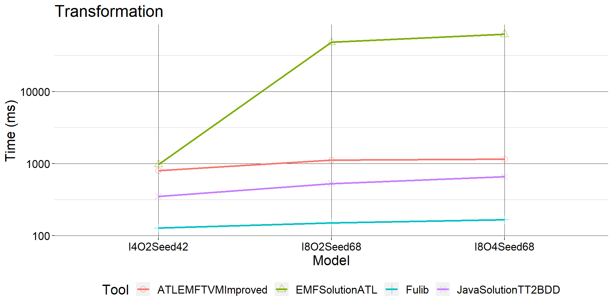
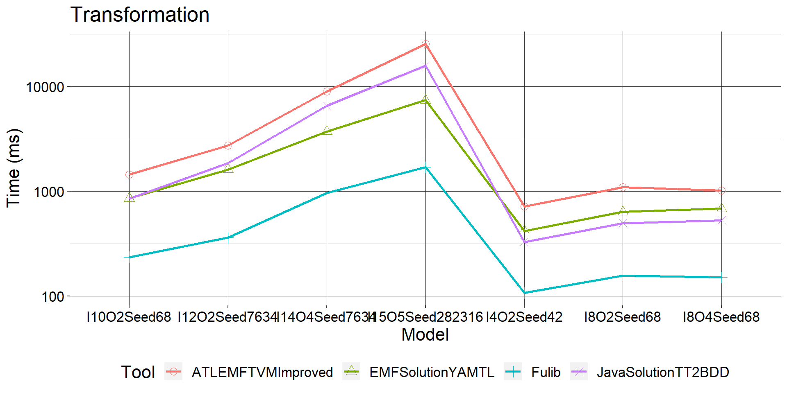

# Groupe 1 : JavaSolutionTT2BDD 

# Pré-requis :
* 64-bit operating system
* Python 3.3 or higher
* R ( dépendances à installer avec le script reporting/install.R)

# Instructions pour l'installation
1. Insérer la solution suivante dans le dossier solutions du framework ttc2019-tt2bdd
2. Inscrire l'entrée "JavaSolutionTT2BDD" dans le tableau "Tools" du fichier config/config.json
3. Éditer les Models à générer et éventuellement le nombre de cycle de test ainsi que le timeout
4. Supprimer le fichier output/output.csv avant de lancer le framework
5. lancer le framework de test à l'aide de la commande suivante depuis la racine du projet (/ttc2019-tt2bdd):
    > ./scripts/run.py
6. (Optionel) Utiliser le validator.jar pour valider les résultats : 
    >
    > java -jar models/validator.jar ttModel bddModel
    > - java -jar models/validator.jar models/GeneratedI8O2Seed68.ttmodel solutions/JavaSolutionTT2BDD/I8O2Seed68.bddmodel
    > - java -jar models/validator.jar models/GeneratedI8O2Seed68.ttmodel solutions/JavaSolutionTT2BDD/GeneratedI8O2Seed68.ttmodel.bddmodel

# Ce qui a été fait et marche / ce qui n’a pas été fait et/ou ne marche pas
Une solution en Kotlin a été développée pour transformer les truth tables reçues en entrée en binary decision diagram.
La solution est capable de : 
 * prendre en entrée un model xmi de type Truthtable comme généré par le generator.jar du projet (model/generator.jar)
 * lire ce modèle et lancer une solution
 * écrire un abre de décision binaire correspondant (validé "All Ok" par le validator.jar)
 * mesurer son temps d'exécution et de transmettre au benchmark les valeurs mesurées

La solution n'est pas capable de :
 * rivaliser avec les meilleures solutions du tournoi en terme de performances brutes
 * transformer d'autres types de modeles
 * optimiser l'arbre (cela incluerait des potentielles modifications de l'arbre produit et donc sa non-validation)

# Les choix
#### Rappel: S'il y a eu choix,  il y avait au moins deux manieres de faire. Décrire les manieres, leurs avantages et inconvenients qui ont permis de choisir

Initiallement, nous étions partis sur une solution en Java. Nous n'étions pas suffisament confiants pour commencer sur un autre langage type Scala par example. 
Néanmoins après le cours sur Android que nous avons eu durant le S1-A3 où nous avons beaucoup utilisé Kotlin, nous nous sommes aperçus que ce langage pouvait nous permettre
de simplifier et de rendre plus concis et élégant le code de notre solution. 

Nous avons donc effectué une transformation de notre solution de Java à Kotlin. Le processus a été très rapide grâce à l'interoperabilité qu'il existe entre les deux langages. 

La solution a été écrit en Kotlin car :
* Ce langage est conforme au cahier des charges du projet (JVM-based)
* Il permet de réaliser des instructions complexes de façon très lisible et élégante ( avec des concepts à la croisée entre Object-Oriented et langage fonctionnel)
* Il est possible d'appeler des fonctions Java depuis Kotlin, et donc d'utiliser l'API EMF fournit avec la solution (utilisation du metamodel TT et BDD)
* Avantages de Kotlin (nativement) sur java : 
    * Singleton
    * Lambda & inline functions
    * null-safety
    * Notions de var & val (variables et constantes)
    * Inférence triviale de type 
    * ... 

# Ce que vous referiez différemment
* Moins de bidouillage au début du projet pour faire tourner sur une machine Linux des solutions dont on pouvait se passer
* Ne pas s'obstiner à vouloir faire tourner une solution si l'on y arrive pas (NMF solution en .net core qui ne fonctionne toujours pas sur nos poste à l'heure actuelle)
* Demander plus rapidement de l'aide en cas de problèmes sur l'utilisation du framework
* Se focaliser sur l'optimisation du model de truth table en entrée

# Ce qui pourrait etre ajoute
* Notre solution pourrait être plus modulaire. A l'heure actuelle, il existe un seul service qui résout le problème de la transformation de TT à BDD. On pourrait imaginer une solution qui pointe de façon plus autonome sur le service compétent pour effectuer la transformation et donc rendre notre solution utilisable pour d'autres modèles.
* Des optimisations supplémentaires dans le code (même si elles sont difficiles à identifier en l'état).
* Une analyse de la complexité de notre transformation pour comprendre où sont les points critiques et donc améliorer les performances.

# Points forts et points faibles de votre projet
## Correctness ✔
Tous les models sont validés par le validateur.
## Conciseness ✔
Le code de la solution est concis. La solution en elle-même est codée sur 200 lignes de code (de façon aérée et avec beaucoup de commentaires).
## Readability ✔
Le code est bien documenté et est lisible.
## Efficiency 🤷
Le résultat sont plutôt bon par rapport aux solutions de base du framework.
Les résultats ne sont cependant pas à la hauteur des gagnants du concours pour le prix des performances (Fulib Solution).
Nous émettons plusieurs hypothèses : 
* La solution Fulib utilise des matrices (les fulibTables) en complément de L'API EMF. Ces dernières sont selon le créateur plus efficace
    > ### Extrait du papier de Albert Zuendorf sur sa solution :
    > I am not sure, how the difference in runtime may be explained. First of all, an `ArrayList<ArrayList<Object>>`
     is a pretty compact and fast model. If we count each ArrayList as one object, the case with 15 + 5 ports has
     2^15 i.e. about 32 000 rows. Within the original EMF Truth Table Model, there are extra objects for each cell.
     These are additional 20 cell objects per row resulting in 640 000 cell objects. Thus, this may account for some
     factor of 20 in memory and accordingly in runtime usage.
     Still, it seems that the EMFSolutionATL is not in the
     same runtime complexity class as the Fulib solution.
* La solution n'est pas très flexible et n'est pas adapté au cas limite 
    > ### Extrait du papier de Albert Zuendorf sur sa solution :
    > To be honest, the current Fulib
    solution works only for regular input (no don’t cares, always the same order of cells)  
## Résultats du benchmark pour quelques modèles simples:

## Résultats du benchmark pour tous les modèles : 
###### (La solution EMFSolutionATL n'est plus dans le graphe car elle ne résout pas les transformation de model plus complexes comme la table à 15 Input et 5 Output)

Nous sommes donc au coude à coude avec la solution EMFSolutionYAMTL, qui a été élue "Most Optimal Solution" du concours.

# Backlog du projet
## 11/10/19 (4h)
- lecture des articles liés aux différentes solutions
- lecture du sujet du tournoi
- téléchargement du projet benchmark et installation sur windows infructueuse
- téléchargement, installation de l'OS et des dépendances projets sur une VM Linux
## 14/10/2019 (4h)
- installation du projet sur la VM : résultat non satisfaisant, trop lent
## 15/10/2019 (4h)
- installation projet sur windows
- adaptation des commandes de chaques solutions
- premier run du projet en entier
- fix des solutions Rsync et NMF
## 25/10/2019 (4h)
- tentative de fix de la visualisation des résultats : benchmark opérationnel
- lecture de la doc eclipse ATL
## 28/10/2019 (4h)
- lancement de plusieurs benchmarks
- création du projet Java
- lecture de la doc gradle & Kotlin
## 29/10/2019 (4h)
- début de l'implémentation de la solution naïve fournie dans l'outline 2.3 du papier
- transformation des inputs ports tt en bdd
- transformation des outputs ports tt en bdd
## 07/11/2019 (hors créneau école) (1h)
- transformation des row en leafs et des cell en assignements
## 13/11/2019(4h)
- récupérer un port qui est utilisé dans toutes les rows
- création des cells qui pointent vers un output port en assignment
## 19/11/2019(4h)
- transformation du projet java en projet kotlin (nous avons eu un cours sur ce sujet et nous pensions être plus en confiance dessus)
- utilisation du framework pour tester la solution
- premiers graphs de benchmark encourageant
## 22/11/2019 (4h)
- Benchmarks de plusieurs solutions
- modification du fichier run.py afin de rendre le nom des solutions plus concis ( et donc plus lisible dans le graph)
- travail sur l'optimisation de l'arbre ( essais manuels de cas de transformation optimisée et comparaison des résultats obtenus avec ceux de la solution)
- Modification du repo git et nettoyage des branches
- branche linux pour run le projet
- validation de tous les résultats produits par la solution (all ok sur tous les schémas)
## 26/11/2019 (4h)
- Documentation finale du projet
- Benchmarks de plusieurs solutions avec le graph rendu plus lisible
